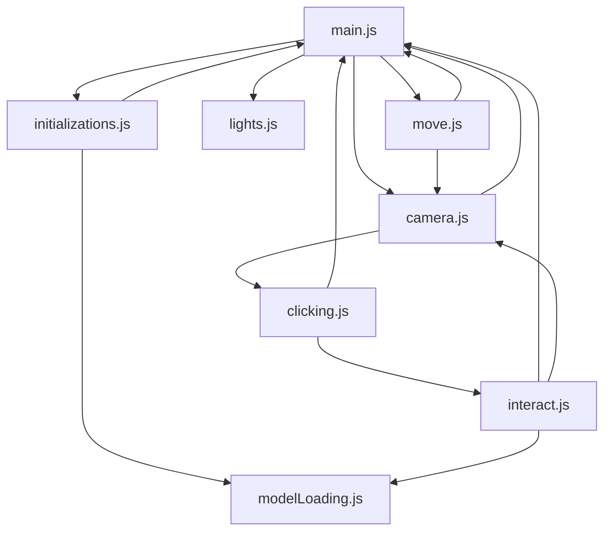

# API Documentation

This document provides detailed API documentation for the Countertop Tea Brewing Simulator modules.

## 📚 Module Overview

| Module | Purpose | Key Exports |
|--------|---------|-------------|
| **main.js** | Application bootstrap | scene, camera, loaded |
| **initializations.js** | Scene setup | initialization_Countertop() |
| **modelLoading.js** | Asset loading | quickLoad(), actions |
| **camera.js** | Camera controls | neutralPos(), CVPos(), controls |
| **lights.js** | Lighting system | standardLight(), ambientOnly() |
| **interact.js** | Game logic | click_interact(), button_interact() |
| **clicking.js** | Input handling | raycastIntersectFromCenter(), pingObject() |
| **move.js** | Physics & movement | move(), speedfactor |
| **loadingScreen.js** | Loading UI | loading_quote() |

---

## 🔧 Core Modules

### main.js
**Purpose**: Application entry point and render loop

#### Exports
```javascript
export let loaded = false;        // Loading state flag
export const scene = new THREE.Scene();  // Main 3D scene
export const camera = new THREE.PerspectiveCamera(60, window.innerWidth / window.innerHeight, 0.2, 1000);
```

#### Usage
```javascript
import * as main from './main.js';
console.log(main.scene);  // Access main scene
console.log(main.loaded); // Check loading state
```

---

### initializations.js
**Purpose**: Scene initialization and model placement

#### Functions

##### `initialization_Countertop()`
**Returns**: `Promise<number>` - Resolves when all models are loaded

**Description**: Initializes the entire 3D scene by loading all models and setting up their initial positions and properties.

**Usage**:
```javascript
import { initialization_Countertop } from './initializations.js';
await initialization_Countertop();
```

##### `init(name, path, loadCallback)`
**Parameters**:
- `name` (string): Unique identifier for the model
- `path` (string): Path to the .glb file
- `loadCallback` (function): Optional callback executed after loading

**Returns**: `Promise<void>`

**Usage**:
```javascript
await init("my_model", "meshes/my_model.glb", (model) => {
    model.position.set(0, 0, 0);
});
```

##### `childTooltip(object, tooltip)`
**Purpose**: Recursively assigns tooltip text to object and all children

**Parameters**:
- `object` (THREE.Object3D): Target object
- `tooltip` (string): Tooltip text to display

**Usage**:
```javascript
childTooltip(myObject, "This is an interactive object");
```

##### `childProp(object, property, value)`
**Purpose**: Recursively assigns a property to object and all children

**Parameters**:
- `object` (THREE.Object3D): Target object
- `property` (string): Property name
- `value` (any): Property value

**Usage**:
```javascript
childProp(myObject, "isInteractive", true);
```

##### `childPropsRecursive(object, properties)`
**Purpose**: Recursively assigns multiple properties to object and all children

**Parameters**:
- `object` (THREE.Object3D): Target object
- `properties` (object): Object with key-value pairs to assign

**Usage**:
```javascript
childPropsRecursive(myObject, {
    isWall: true,
    isInteractive: false
});
```

---

### modelLoading.js
**Purpose**: 3D model loading and animation management

#### Exports
```javascript
export const actions = {};  // Animation actions storage
```

#### Functions

##### `quickLoad(scene, name, path, dump)`
**Parameters**:
- `scene` (THREE.Scene): Target scene to add model to
- `name` (string): Unique name for the loaded model
- `path` (string): Path to .glb file
- `dump` (boolean): Whether to log model hierarchy to console

**Returns**: `Promise<THREE.Object3D>` - Loaded model

**Usage**:
```javascript
import { quickLoad, actions } from './modelLoading.js';
const model = await quickLoad(scene, "myModel", "meshes/model.glb", true);

// Access animations
actions['AnimationName'].play();
actions['AnimationName'].setLoop(THREE.LoopRepeat, 10);
```

#### Animation Actions
Animation clips are automatically loaded and stored in the `actions` object:
```javascript
// Available after model loads
actions['DoorOpen'].play();
actions['ShrimpAction'].setLoop(THREE.LoopOnce);
actions['DemonYeah'].reset().play();
```

---

### camera.js
**Purpose**: Camera positioning and controls

#### Exports
```javascript
export let controls;  // PointerLockControls instance
```

#### Functions

##### `neutralPos(start, object, offset)`
**Purpose**: Set camera to neutral starting position

**Parameters**:
- `start` (boolean): Whether this is the initial setup
- `object` (THREE.Camera): Camera to position (defaults to main camera)
- `offset` (array): [x, y, z] offset values

**Usage**:
```javascript
import { neutralPos } from './camera.js';
neutralPos(true);  // Initial setup
neutralPos(false, myCamera, [1, 0, 0]);  // Custom camera with offset
```

##### `windowPos(object, offset)`
**Purpose**: Position camera at window view

**Parameters**:
- `object` (THREE.Camera): Camera to position
- `offset` (array): [x, y, z] offset values

##### `CVPos(object, offset)`
**Purpose**: Position camera for CV viewing mode

**Parameters**:
- `object` (THREE.Camera): Camera to position
- `offset` (array): [x, y, z] offset values

#### PointerLockControls
The `controls` export provides first-person camera controls:
```javascript
import { controls } from './camera.js';

// Check if controls are active
if (controls.isLocked) {
    // Controls are active
}

// Lock controls (usually done on user click)
controls.lock();
```

---

### lights.js
**Purpose**: Lighting configuration

#### Functions

##### `standardLight(scene)`
**Purpose**: Set up standard lighting for the scene

**Parameters**:
- `scene` (THREE.Scene): Target scene

**Lighting Setup**:
- Ambient light: 0xffeeff, intensity 0.4
- Directional light: 0xfaaa50, intensity 0.8
- Secondary directional light: 0xfaaa50, intensity 0.5
- Hemisphere light: 0xefeacc / 0x6c9cac, intensity 0.5
- Additional directional light: 0xfaaa50, intensity 0.8

**Usage**:
```javascript
import { standardLight } from './lights.js';
standardLight(scene);
```

##### `ambientOnly(scene)`
**Purpose**: Set up minimal ambient lighting

**Parameters**:
- `scene` (THREE.Scene): Target scene

**Usage**:
```javascript
import { ambientOnly } from './lights.js';
ambientOnly(scene);  // For dark/atmospheric scenes
```

---

## 🎮 Interaction System

### interact.js
**Purpose**: Game logic and object interactions

#### Functions

##### `click_interact(object)`
**Purpose**: Handle object interactions based on object name

**Parameters**:
- `object` (THREE.Object3D): The clicked object

**Supported Interactions**:
- **Door interactions**: "DemonDoor_1", "DemonDoor_3", "Door_1", "Door_3"
- **Audio interactions**: "Shrimp_1", "Guitar_2"
- **Water collection**: "Lake"
- **Tea brewing**: "LeavesLeft", "LeavesMiddle", "LeavesRight"
- **UI interactions**: "Paper", "Paper_2", "CV_Paper"

**Usage**:
```javascript
import { click_interact } from './interact.js';
click_interact(clickedObject);
```

##### `button_interact(event, up)`
**Purpose**: Handle keyboard interactions

**Parameters**:
- `event` (KeyboardEvent): The keyboard event
- `up` (boolean): Whether key is being released

**Usage**:
```javascript
// Usually handled automatically via event listeners
document.addEventListener('keydown', (e) => button_interact(e));
document.addEventListener('keyup', (e) => button_interact(e, true));
```

---

### clicking.js
**Purpose**: Mouse input handling and raycasting

#### Exports
```javascript
export const raycaster = new THREE.Raycaster();  // Shared raycaster
```

#### Functions

##### `raycastIntersectFromCenter(event)`
**Purpose**: Cast ray from camera center

**Parameters**:
- `event` (MouseEvent): Mouse event (unused, but kept for consistency)

**Returns**: `Array<THREE.Intersection>` - Array of intersections

**Usage**:
```javascript
import { raycastIntersectFromCenter } from './clicking.js';
const intersects = raycastIntersectFromCenter(event);
if (intersects.length > 0) {
    const clickedObject = intersects[0].object;
}
```

##### `raycastIntersectFromWaist(event)`
**Purpose**: Cast ray from waist level (for tooltips)

**Parameters**:
- `event` (MouseEvent): Mouse event

**Returns**: `Array<THREE.Intersection>` - Array of intersections

##### `pingObject(object)`
**Purpose**: Visual debugging - highlight object temporarily

**Parameters**:
- `object` (THREE.Object3D): Object to highlight

**Usage**:
```javascript
import { pingObject } from './clicking.js';
pingObject(myObject);  // Briefly highlights the object
```

---

## 🏃 Movement System

### move.js
**Purpose**: Player movement, physics, and collision detection

#### Exports
```javascript
export let speedfactor = 200;  // Current movement speed
```

#### Functions

##### `move()`
**Purpose**: Main movement update function (called every frame)

**Usage**:
```javascript
import { move } from './move.js';
// Called automatically in render loop
renderer.setAnimationLoop(() => {
    move();  // Update player movement
});
```

#### Movement Configuration
```javascript
// Constants (can be adjusted)
const GRAVITY = -150;        // Gravity force
const JUMP_FORCE = 30 * 100; // Jump power
```

#### Key State Tracking
The module automatically tracks:
- **W/A/S/D** or **Arrow Keys**: Movement
- **Shift**: Running (speedfactor = 400)
- **C**: Zoom (camera focal length change)
- **P**: Reset position
- **Space**: Jump

---

## 🎬 Loading System

### loadingScreen.js
**Purpose**: Loading screen with random quotes

#### Functions

##### `loading_quote()`
**Purpose**: Display random loading quote

**Features**:
- Random selection from 50+ quotes
- Special birthday message on December 5th
- Animated text reveal

**Usage**:
```javascript
import { loading_quote } from './loadingScreen.js';
loading_quote();  // Called automatically during initialization
```

---

## 🎯 Usage Examples

### Complete Interaction Flow
```javascript
// Example: Adding a new interactive object
import { quickLoad } from './modelLoading.js';
import { childTooltip, childPropsRecursive } from './initializations.js';

// 1. Load the model
const myModel = await quickLoad(scene, "myTeapot", "meshes/teapot.glb");

// 2. Set up properties
childPropsRecursive(myModel, {
    isInteractive: true,
    isGround: false
});

// 3. Add tooltip
childTooltip(myModel, "A magical teapot");

// 4. Add to interaction system (in interact.js)
case "myTeapot":
    // Custom interaction logic
    console.log("Teapot clicked!");
    break;
```

### Custom Movement Behavior
```javascript
// Example: Temporarily increase speed
import { speedfactor } from './move.js';

// Save original speed
const originalSpeed = speedfactor;

// Increase speed temporarily
speedfactor = 1000; // Super speed!

// Reset after 5 seconds
setTimeout(() => {
    speedfactor = originalSpeed;
}, 5000);
```

### Camera Positioning
```javascript
// Example: Smooth camera transition
import { CVPos } from './camera.js';

// Move to CV view
CVPos();

// Return to neutral after 3 seconds
setTimeout(() => {
    neutralPos();
}, 3000);
```

---

## 🔧 Debugging API

### Console Commands
```javascript
// Available in browser console
console.log(scene.children);           // View scene hierarchy
console.log(actions);                  // View available animations
console.log(camera.position);          // Check camera position
console.log(raycaster);                // Check raycaster state
```

### Debug Properties
```javascript
// Add to any object for debugging
object.userData.debug = true;
object.userData.originalColor = object.material.color.clone();
```

---

## 📊 Performance API

### Monitoring Functions
```javascript
// Add to main.js for performance monitoring
function getPerformanceStats() {
    return {
        fps: renderer.info.render.frame,
        geometries: renderer.info.memory.geometries,
        textures: renderer.info.memory.textures,
        drawCalls: renderer.info.render.calls
    };
}
```

---

## 🔄 Module Dependencies



This API documentation covers all public interfaces and common usage patterns for the Countertop Tea Brewing Simulator.